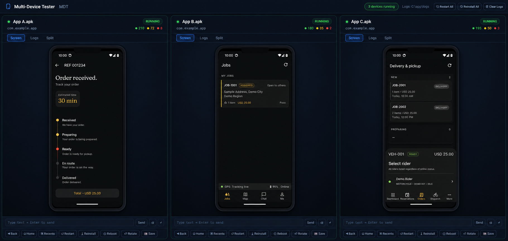

<h1 align="center">MDT</h1>

<p align="center"><b>Multi-Device Tester — run two Android apps side-by-side in your browser.</b></p>

<p align="center">
  
  
  
  
  
</p>

---

MDT boots up to **two headless Android emulators**, installs one APK into each, and streams them **live and fully interactive, side-by-side in your browser**. Each app leaves behind its own **colour-coded log trail** — green for OK, yellow for warnings, red for errors — both live in the UI and saved to disk.

Drop your APKs in a folder, run one command, and test. No physical phones, no Android Studio, no manual SDK setup, no Docker.

<p align="center">
  
</p>

> Add your own screenshot at `screenshot.png`.

## Features

- **Two emulators, side-by-side** — one APK per emulator, fully isolated.
- **Smooth H.264 video** — WebCodecs GPU decode to `<canvas>`, not screenshot polling.
- **Full interaction** — tap, swipe, type, Back / Home / Recents via adb.
- **Colour-coded log trails** — live logcat + JSONL/raw persistence in `logs/`.
- **Built-in APK tests** — launch, crash/ANR detection, permissions, memory, network, UI taps ([docs](docs/BUILTIN_TESTS.md)).
- **Live reload** — watch Gradle/build output and auto `adb install -r` per device ([docs](docs/LIVE_RELOAD.md)).
- **Per-device controls** — restart, reinstall, reboot, rotate, screenshot.
- **One command, self-contained** — Python venv + Android SDK live in the project folder.
- **Memory-aware startup** — auto-lowers per-emulator RAM under pressure (8 GB profile defaults).

## Requirements

- **Windows 10 or 11**
- **Python 3.11** (on `PATH` as `py` or `python`)
- **Hardware acceleration (WHPX)** — enable once in admin PowerShell, then reboot:
  ```powershell
  Enable-WindowsOptionalFeature -Online -FeatureName HypervisorPlatform -All
  ```
- **Chromium browser** — Chrome or Edge (WebCodecs required).
- **~4–8 GB free RAM** for two emulators at default settings.
- **Internet on first run** — MDT downloads cmdline-tools and a system image into `.android-sdk/`.

## Quick start

```bash
git clone https://github.com/<you>/MDT.git
cd MDT
.\start.bat
```

`start.bat` creates the venv, installs dependencies, bootstraps the SDK, boots emulators, and opens **http://localhost:8000**.

The **first run is slow** (SDK + system image download + cold boot). Subsequent runs use quickboot snapshots.

## Usage

1. Drop up to **two** `.apk` files into `apk_input/`.
2. Run `.\start.bat`.
3. Watch each pane boot → install → launch.
4. Open the **Tests** tab on any device to run built-in APK checks.

Logs: `logs/<apk-name>_<timestamp>.jsonl` and `.log`.

If `apk_input/` is empty, the server starts and waits — add APKs and they are picked up within a few seconds.

## Configuration

Tunables live in **`config.py`** (see also `.env.example` for reference):

| Setting | Default | Description |
| --- | --- | --- |
| `MAX_DEVICES` | `2` | Max emulators / APKs at once. |
| `EMULATOR_MEMORY_MB` | `1536` | RAM per emulator (auto-lowered under pressure). |
| `BOOT_STAGGER_SEC` | `8` | Delay between parallel emulator boots. |
| `SCREENRECORD_SIZE` | `540x1170` | Stream resolution (keep aspect ratio). |
| `SCREENRECORD_BITRATE` | `2_000_000` | H.264 bitrate (bits/sec). |
| `API_LEVEL` | `34` | Android system image API level. |
| `DEVICE_PROFILE` | `pixel_5` | AVD hardware profile. |
| `EMULATOR_GPU_MODE` | `host` | GPU mode for emulator. |
| `SERVER_PORT` | `8000` | Local web UI port. |

### 8 GB RAM profile

Defaults are tuned for ~8 GB host RAM: 1536 MB/emulator, 540×1170 stream, 2 Mbps bitrate, staggered boots. If emulators fail to start, lower `EMULATOR_MEMORY_MB` further or run one APK at a time.

## Built-in tests

See **[docs/BUILTIN_TESTS.md](docs/BUILTIN_TESTS.md)** for what each test checks and how to read results.

REST endpoints:

- `GET /api/device/{index}/tests` — list test names
- `POST /api/device/{index}/tests/run` — run selected or all tests
- `POST /api/device/{index}/tests/{test_name}` — run one test
- `GET /api/device/{index}/tests/status` — poll progress/results

### Live reload

See **[docs/LIVE_RELOAD.md](docs/LIVE_RELOAD.md)** for Gradle/Android Studio setup.

- `GET /api/device/{index}/live-reload/status`
- `POST /api/device/{index}/live-reload/enable`
- `POST /api/device/{index}/live-reload/disable`
- `POST /api/device/{index}/live-reload/sync`

## Live reload (local testing)

Before pushing to GitHub, verify live reload on your machine:

1. **Start MDT** with at least one APK in `apk_input/`:
   ```bash
   cd /path/to/MDT
   .\start.bat
   ```
   Or on Linux/macOS for dev:
   ```bash
   python -m venv .venv && .venv/bin/pip install -r requirements.txt
   python run.py
   ```

2. **Open** http://localhost:8000 and wait until a device shows **running**.

3. **Set watch path** — on the device card (Screen tab), click **Path** and enter your debug APK, e.g.:
   ```
   C:\your-project\app\build\outputs\apk\debug\app-debug.apk
   ```

4. **Enable Live Reload** — check the toggle; status should show **Watching**.

5. **Trigger a rebuild** — in your Android project:
   ```bash
   ./gradlew assembleDebug
   ```
   Or use Android Studio **Build → Make Project**.

6. **Confirm sync** — status briefly shows **Syncing…**, then **Watching** with a new timestamp; the app relaunches on the emulator.

7. **Test per-device independence** — with two APKs/devices, enable reload on device 0 only; rebuild device 0's APK and confirm device 1 is unchanged.

8. **Run unit tests**:
   ```bash
   .venv/bin/pytest tests/test_live_reload.py tests/test_smoke.py -q
   ```

9. **API smoke test** (optional, device 0 must exist and be running):
   ```bash
   curl -s http://127.0.0.1:8000/api/device/0/live-reload/status
   curl -s -X POST http://127.0.0.1:8000/api/device/0/live-reload/enable \
     -H "Content-Type: application/json" \
     -d '{"watch_path":"apk_input/your.apk"}'
   ```

## How it works

FastAPI orchestrates each device: **ensure AVD → boot headless emulator → install APK → launch → logcat + H.264 stream**. Per-device WebSockets carry video, logs, state, and test events; input goes back through adb.

`screenrecord` has a 180 s limit — MDT respawns the stream transparently.

## Project structure

```
MDT/
├── start.bat            # one-command launcher
├── run.py               # entrypoint
├── config.py            # paths, ports, tunables
├── requirements.txt
├── docs/BUILTIN_TESTS.md
├── docs/LIVE_RELOAD.md
├── app/
│   ├── main.py          # FastAPI routes, orchestration
│   ├── apk_tests.py     # built-in test framework
│   ├── live_reload.py   # per-device hot reload watcher
│   ├── sdk.py           # Android SDK bootstrap
│   ├── emulator.py      # headless launch + boot wait
│   ├── device.py        # adb wrappers
│   └── ...
├── static/              # index.html, app.js, style.css
├── apk_input/           # drop APKs here
├── logs/                # log trails (runtime)
└── .android-sdk/        # project-local SDK
```

## Known limitations

- **Windows-focused** — acceleration uses WHPX.
- **Chromium only** — WebCodecs required.
- **Stream latency ~0.5–1 s** — fine for functional QA, not timing benchmarks.
- **Emulators only** — no physical-device support yet.

## Development

```bash
python -m venv .venv
.venv/Scripts/pip install -r requirements.txt
pytest tests/ -q
python -c "from app.main import app; print('OK')"
```


## Contributors

- [**Josaphat12-tech**](https://github.com/Josaphat12-tech) — audit fixes, two-device layout, built-in APK tests, live reload, and pytest/test improvements. See [CONTRIBUTORS.md](CONTRIBUTORS.md).

## License

MIT — see [LICENSE](LICENSE).

---

<p align="center"><sub>MDT — Multi-Device Tester</sub></p>
